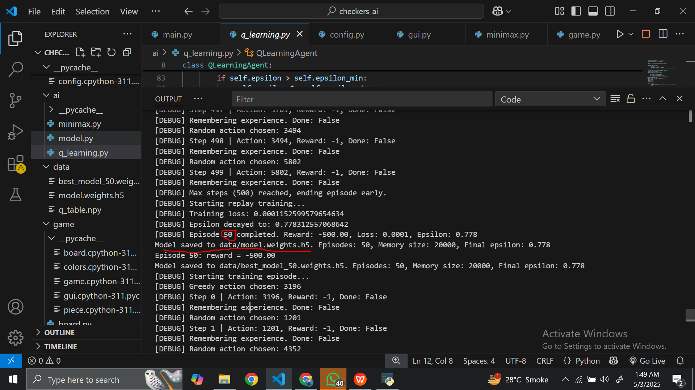
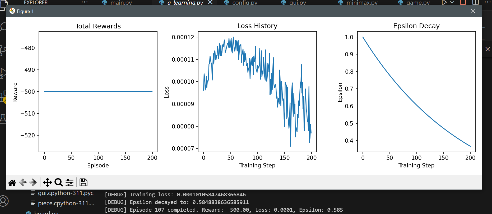

<!DOCTYPE html>
<html lang="en">
<head>
    <meta charset="UTF-8">
    <meta name="viewport" content="width=device-width, initial-scale=1.0">
</head>
<body>
    <h1 style="color: #28a745;">🧠 Checkers AI Agent</h1>
    
An intelligent agent that plays the game of <strong>Checkers</strong> using <strong>Q-Learning</strong> and <strong>Alpha-Beta Pruning</strong>. Built using <strong>Python</strong> and <strong>Pygame</strong>, the agent can learn through self-play and make strategic moves against human players in a classic board game environment.

    

    <h2>📌 Project Overview</h2>
    
This project focuses on building an adaptive AI for Checkers by combining <strong>reinforcement learning (Q-learning)</strong> with <strong>traditional decision-making algorithms (Minimax with Alpha-Beta Pruning)</strong>. It also includes an engaging graphical interface for human-AI interaction, real-time gameplay, and performance analytics.

    

    <h2>🗂️ Repository Structure</h2>
    <pre><code>
checkers-ai-project/
├── README.md
├── Project Proposal Checkers.docx
├── Project Report CheckersAI.pdf
├── demo_video.mp4
├── requirements.txt
│
├── src/
│   └── checkers-AI/
│       ├── ai/
│       │   ├── minimax.py
│       │   ├── model.py
│       │   └── q_learning.py
│       ├── data/
│       │   └── best_model_50.weights.h5
│       ├── game/
│       │   ├── board.py
│       │   ├── game.py
│       │   ├── gui.py
│       │   └── piece.py
│       ├── utils/
│       │   ├── helpers.py
│       │   └── loggers.py
│       ├── config.py
│       └── main.py
│       ├── training_progress.PNG
│       └── graphs.png
│
└── models/
      └── best_model_50.weights.h5
    </code></pre>
    

    <h2>🎥 Demo Video</h2>
    
🔗 <a href="https://drive.google.com/file/d/14nNbErcSa3PnQWTPevzSdX7je4Nr3kDd/view?usp=sharing"><strong>Watch Demo Video</strong></a> – See the AI in action playing against a human.

    

    

        <h2>🚀 Getting Started</h2>
        <h3>Step 1: Clone the Repository</h3>
        <pre><code>git clone [https://github.com/ssarimm/checkers-ai-project.git](https://github.com/ssarimm/checkers-ai-project.git)
cd checkers-ai-project</code></pre>
        <h3>Step 2: Install Requirements</h3>
        <pre><code>pip install -r requirements.txt</code></pre>
        <h3>Step 3: Run the Game</h3>
        <pre><code>python src/checkers-AI/main.py</code></pre>
    

    

    <h2>✨ Features</h2>
    <ul>
        <li>🧠 Q-Learning Agent: Learns from self-play to improve gameplay.</li>
        <li>♟️ Minimax Agent: Uses Alpha-Beta Pruning for efficient decision-making.</li>
        <li>🎮 Interactive GUI: Built with Pygame for smooth gameplay.</li>
        <li>📊 Performance Analysis: Optional performance tracking (win rate, move time, etc.).</li>
        <li>🔄 Multi-jump & King Rules: Complete Checkers rules implemented.</li>
    </ul>
    

    <h2>📈 Training Progress</h2>
    
Here's a visualization of the training progress:

    
    <h2>📊 After Training Results</h2>
    
These graphs illustrate the performance of the AI after training:

    
    

    <h2>🛠️ Technologies Used</h2>
    <ul>
        <li>Python 3.10+</li>
        <li>Pygame</li>
        <li>NumPy</li>
        <li>TensorFlow or PyTorch (for advanced RL, optional)</li>
        <li>GitHub (Version control)</li>
    </ul>
    

    <h2>⚙️ Configuration</h2>
    
Edit values like training episodes, epsilon decay, board size, or UI settings in: <code>src/checkers-AI/config.py</code>

    

    <h2>📚 Documentation</h2>
    <ul>
        <li>📄 <a href="Project Proposal Checkers.docx">Project Proposal</a></li>
        <li>📄 <a href="Project Report CheckersAI.pdf">Final Report</a></li>
        <li>📽️ <a href="demo_video.mp4">Demo Video</a></li>
    </ul>
    

    <h2>📘 References</h2>
    <ul>
        <li>Sutton, R. S., & Barto, A. G. (2018). <em>Reinforcement Learning: An Introduction</em>.</li>
        <li>Pygame documentation: <a href="https://www.pygame.org/docs/">https://www.pygame.org/docs/</a></li>
        <li>TensorFlow documentation: <a href="https://www.tensorflow.org/api\_docs">https://www.tensorflow.org/api\_docs</a></li>
    </ul>
    

</body>
</html>
